- [*Colored Walls*](#colored-walls)
    - [Dark Green](#dark-green)
    - [Dark Blue](#dark-blue)
    - [Red](#red)
    - [Yellow](#yellow)
- [*Textured Walls*](#textured-walls)
    - [Brick](#brick)
    - [Wood](#wood)
    - [Black Paint](#black-paint)
    - [White Paint](#white-paint)
- [*Parquets*](#parquets)
    - [Dark Parquet](#dark-parquet)
    - [Light Parquet](#light-parquet)
- [*Concretes*](#concretes)
    - [Dark Grey Concrete](#dark-grey-concrete)
    - [Grey Concrete](#grey-concrete)
    - [Fake Ceiling](#fake-ceiling)
    - [Grainy Ceiling](#grainy-ceiling)
- [*Metals*](#metals)
    - [Iron](#iron)
    - [Brushed Metal](#brushed-metal)
    - [Black Metal](#black-metal)
- [*Papers*](#papers)
    - [Paper Sheets](#paper-sheets)
    - [Toilet Paper](#toilet-paper)
- [*Textiles*](#textiles)
    - [Grey Tissue](#grey-tissue)
- [*Others*](#others)
    - [White Plastic](#white-plastic)
    - [Porcelain](#porcelain)

# Amphitheater

#### Seats
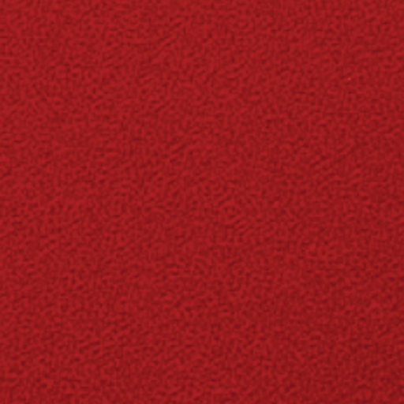

#### Steps
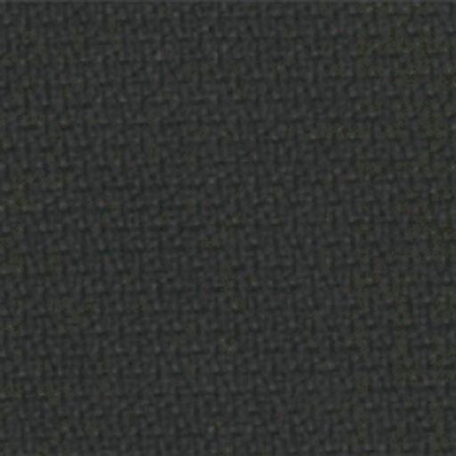

---
# Walls

## *Colored Walls*

#### Dark Green
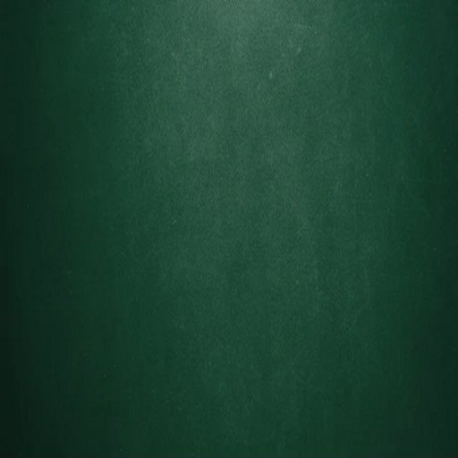

#### Dark Blue
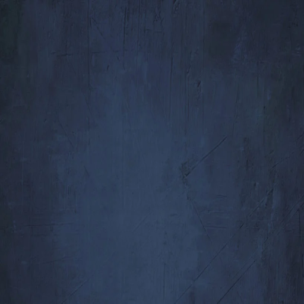

#### Red
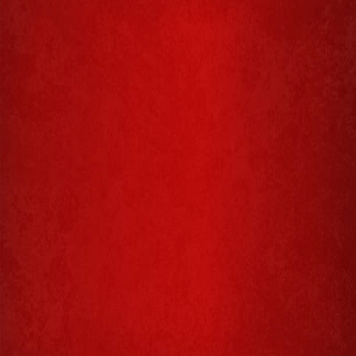

#### Yellow
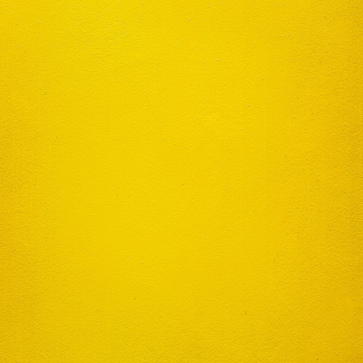

## *Textured Walls*

#### Brick
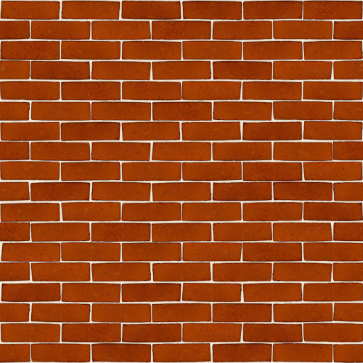

#### Wood
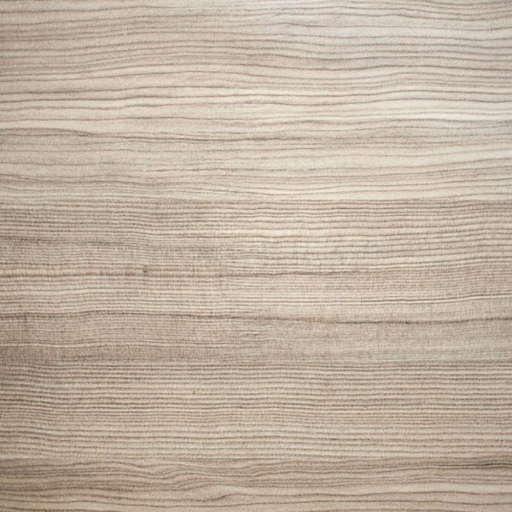

---
# Paint

#### Black Paint
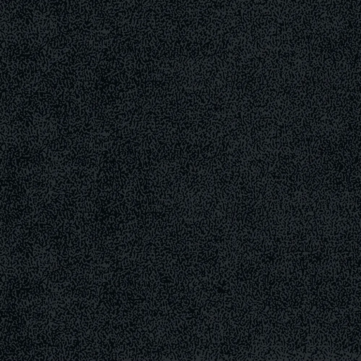

#### White Paint
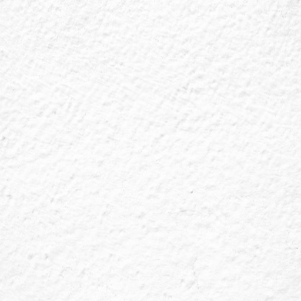

---
# Floors

## *Parquets*

#### Dark Parquet
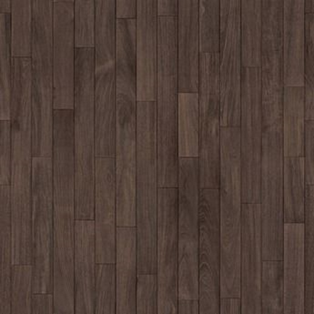

#### Light Parquet
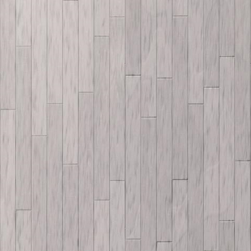

## *Concretes*

#### Dark Grey Concrete
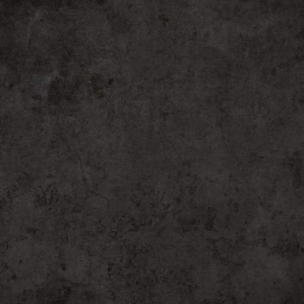

#### Grey Concrete
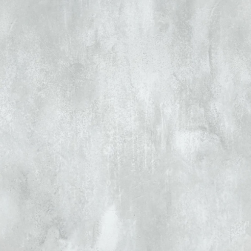

---
# Ceilings

#### Fake Ceiling
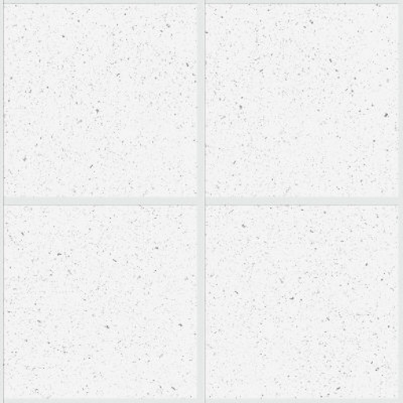

#### Grainy Ceiling
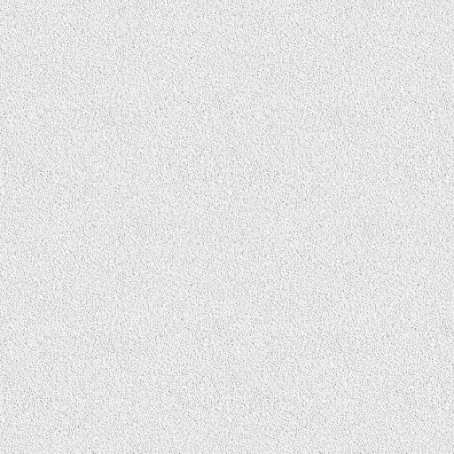

---
# Miscellaneous

## *Metals*

#### Iron
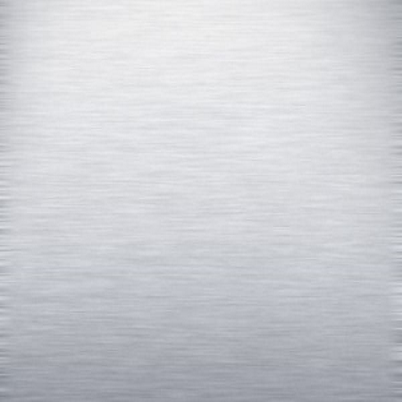

#### Brushed Metal
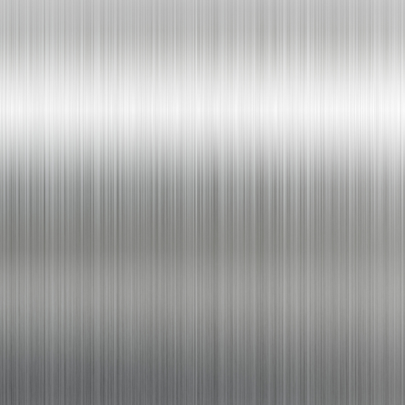

#### Black Metal
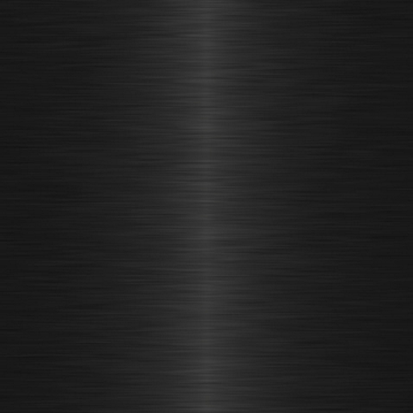

## *Papers*

#### Paper Sheets
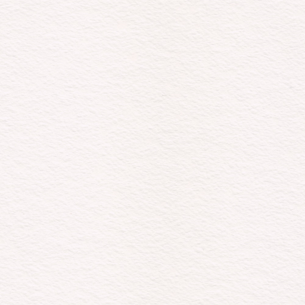

#### Toilet Paper
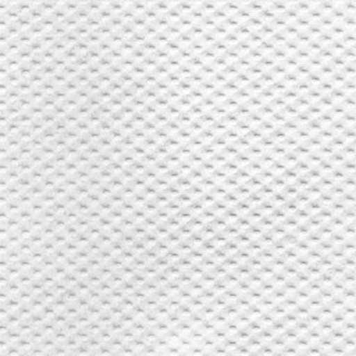

## *Textiles*

#### Grey Tissue
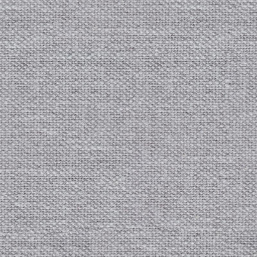

## *Others*

#### White Plastic

#### Porcelain
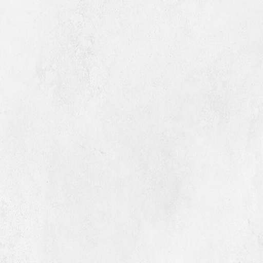